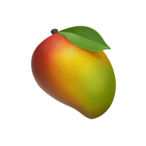

<!-- ================= Header Wave ================= -->

## 🌙 关于我

- 🔭 **在尝试** — 多 Agent 系统 / 合同风险审查 / 行业智能体
- 🌱 **在学习** — Agent 工程化 · LLM 应用落地，还差得远，但在进步
- 🧩 **喜欢用** — TypeScript · Automation，把重复的事交给程序
- 💬 **小心愿** — 把想法慢慢做成真正可用的工具
- ⚡ **相信** — 一点一点，把代码写成轨迹

 

---

## 🛠️ 技术栈

   
  

---

## 🚀 精选项目

  
  &nbsp;&nbsp;&nbsp;&nbsp;&nbsp;&nbsp;&nbsp;&nbsp;&nbsp;&nbsp;&nbsp;&nbsp;
  
  &nbsp;&nbsp;&nbsp;&nbsp;&nbsp;&nbsp;&nbsp;&nbsp;&nbsp;&nbsp;&nbsp;&nbsp;
  

  <b>法飞飞 AI</b> · 合同审查小助手&nbsp;&nbsp;&nbsp;&nbsp;&nbsp;&nbsp;&nbsp;
  <b>xiehui-agent</b> · 协会办公小桌宠&nbsp;&nbsp;&nbsp;&nbsp;&nbsp;&nbsp;
  <b>xiaomang</b> · AI 选题小工具

 

  项目都还很小，但每一个都在认真打磨 🌱

---

## 📊 GitHub 数据

  
  

  

  

---

## 🏆 成就墙

  

---

  <picture>
    <source media="(prefers-color-scheme: dark)" srcset="https://raw.githubusercontent.com/spaceyzx216/spaceyzx216/output/github-contribution-grid-snake-dark.svg"/>
    
  </picture>

  ✨ 一点一点，把代码写成轨迹 ✨

<!-- ================= Footer Wave ================= -->

